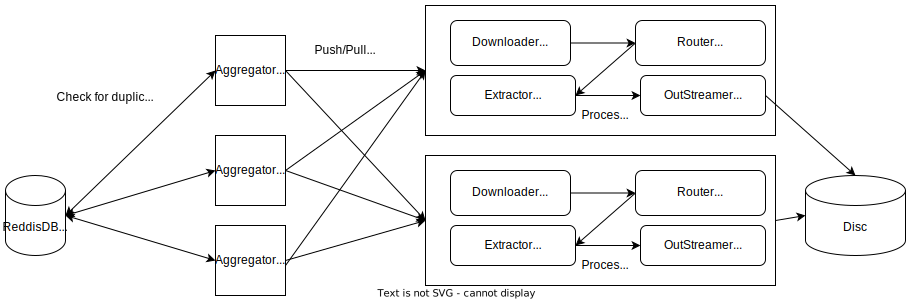

# Short description

The goal of my semester project is to create distributed web crawler
for extracting articles and metadata from the Czech news websites.
The crawler will not directly crawl the web but instead it will crawl archived websites
gathered by Common Crawl initiative.
For each website the program will retrieve all possible articles originating on the website.
The articles will be cleared of all html tags and only the article text with its structure will be
extracted.
Aside from the article itself the program will retrieve these attributes if
present: [Headline, Brief/Abstract, Author, Publication date, Keywords,
Category, Count of comments in discussion section].

The program will support these websites.

### Supported websites:

- www.idnes.cz (2013-Today)
- www.novinky.cz (2013-2018) OR (2019-Today)
- www.aktualne.cz (2013-Today)
- www.seznamzpravy.cz (2018-Today)
- www.denik.cz (2013-Today)
- www.irozhlas.cz (2017-Today)
- www.lidovky.cz (2013-Today)

The project will be written in Python 3.10 with usage of type annotations(typing).
Main focus will be given to scalability(deployment on cluster), fault-tolerance and high throughput.
Docker-swarm will be used for orchestration purposes. Reddis will be used for semi-persistent storage and
ActiveMQ will be used for message queues. To achieve high single-threaded throughput async programming
concepts will be used(asyncio).

# Architecture

The project will be split into two parts. Aggregator and Processor.
The main task of Aggregator is to aggregate all article urls for supported websites and pass them to Processor.
The main task of Processor is to extracted the data from websites and save them on the disc

## Aggregator

In typical vanilla crawling, we build list of urls to visit as we go. Program visits the url, finds `href` links
and add these links to frontier/list of urls to visit next. Obviously there can be many links targeting one website,
thus another list of already visited websites is need in order to prevent duplicities and cycles in worst case.
With Common Crawl(CC) things are much easier. Since space of all urls is finite, CC maintains index
of urls it has crawled.
We can than query such index for specified domain to get all urls with respect
to that domain. Note that sometimes news servers use subdomain to distinguish between categories.
This needs to be accounted for. Another important thing is that CC releases new crawls in monthly
frequencies and for each crawl new index is created. Thus it is still needed to check for duplicate urls.
As I said it is possible to query CC index and there are multiple ways to do it.

1. [Query CDXJ Api provided by CC](https://pywb.readthedocs.io/en/latest/manual/cdxserver_api.html#api-reference)
   Easy to query, speed depends on external API server
2. [Manually Query CC Index Table](https://github.com/commoncrawl/cc-index-table/blob/master/README.md)
   Big data framework needed for queries(Apache Hive/SparkSQL), but read should be faster

### Duplicates storage

As we wish to build a distributed application, we cannot use in memory lists, because we can run multiple
aggregators, thus data storage needs to be shared. For this task we will use RedisDB. It's in-memory key-value
database. RedisDB was chosen because we need fast R/W(this is achieved by storing data in-memory) and
we don't need complex data structures, thus key-value storage is fine. It also provides semi-persistency with it's
memory snapshots. Another DB which was considered was Memcached. However it doesn't provide persistency and keys
can be only 256B longer, which could be an issue.

## Processor

The processor pipeline can be seen in overview image. Since pipelines don't interfere with each other
we can run multiple pipelines at the same time in one Processor using async programming.
This is very important because a lot of time will be spend waiting for Downloader to download date.

We will describe its components now

### Downloader

This module will receive link to an WARC file and offset in WARC and will download WARC segment containing date for
specified link. It will parse important info from HTTP headers and pass the info alongside with received HTML file.

#### What is WARC file ?

In brief it is a data format for storing web crawls. For each url it contains HTTP response+request
and content retrieved.
More detailed info about [WARC](https://archive-it.org/blog/post/the-stack-warc-file/).

### Router

Router will lookup registered Extractors and choose an Extractor based on regex match in url received from Downloader.
Similar idea to how [Django](https://www.djangoproject.com/) routes requests to views.

### Extractor

Extractor receives parsed information from WARC file along with HTML file content.
It's goal is to extract information as described in _Short Description_. Since every domain
stores information differently there will be needed one extractor per domain. Extractors will be defined
as python files and will be registered to Router for forwarding. Each extractor file will contain a class
which is derived from Extractor based class and thus appropriate method(parse method) will exist on such a class.

#### HTML parsing ?

HTML parsing can be done manually using regex without any deeper knowledge of html structure.
However this approach will lead to not well maintainable code and as second problem it is hard
to extract more complex structures using just regex. Therefore html parser will be used to perceive
html structure.
In python there are two leading libraries for parsing HTML files.

1. [BeautifulSoup4](https://www.crummy.com/software/BeautifulSoup/bs4/doc)
2. [selectolax](https://selectolax.readthedocs.io/en/latest/lexbor.html)

From quick skimming through documentation, there is no significant difference.
Both are capable of parsing html documents and querying based on css selectors.
I haven't found any reliable benchmark of these only few articles [1](https://medium.com/@ArtMyftiu/web-data-extraction-in-its-multitudes-using-python-b5849b92931c) , [2](https://rushter.com/blog/python-fast-html-parser/). Also people of HackerNews confirmed this bias so it must be true :)

### Outstreamer

This implement logic for saving retrieved data on local disc.

## MiddleWare

Aggregator and Processor needs to be connected. We will implement this connection using message queue.
Message queue is chosen because we ideally want to delivery one message from Aggregator to exactly one Processor.
The problem here is that while theoretically possible in practice it's not possible to implement exactly one delivery
with reasonable throughput. This is due to the fact that network is unreliable and receiving nodes can go offline
at any time without acknowledging the completion of message. Therefore the at most one strategy is chosen, because
few dropped articles don't make any difference and at least one is not the best solution because we would have to
add another layer after the pipeline to remove duplicates. There are many protocols implements wanted properties.
Namely Reddis Streams, ActiveMQ, RabbitMQ and many others. The problem with Reddis streams is that it doesn't
allow for strong persistent unlike ActiveMQ. Both ActiveMQ and RabbitMQ are feasible for task. At the end ActiveMQ
was chosen.

## Misc

### Threading vs Async

It is clear that program will be IO-bound. Most of the time will be spent waiting for data to download from external
server. This means that parallelization is not good approach for such task and it yields good results
if the task is CPU bound. Therefore the decision is between asyncio and threading.
Since a lot of requests will be spawned at the same time the fastest and best approach seems to be asyncio,
because threading will use a lot of resources for thread orchestration and we don't need features that threading
would bring us.

### Why CommonCrawl and not vanilla crawling ?

There are many reasons against vanilla crawling,
this [article](https://scrapeops.io/blog/the-state-of-web-scraping-2022/) summarizes them pretty well.

#### Main problems:

- Admins don't like bots making too many requests on their site -> various technics to block bots/crawlers from website eg. (ip filtering, canvas fingerprints). This needs to be dealt with.
- Cloudflare/Captcha protection on many sites
- Big bottleneck of network bandwidth (can be partially solved by events)
- Prevention of circles when discovering new urls
- Javascript rendering (SPA)

### Advantages:

- We can theoretically access any site available, with CC we can only retrieved urls indexed by CC
